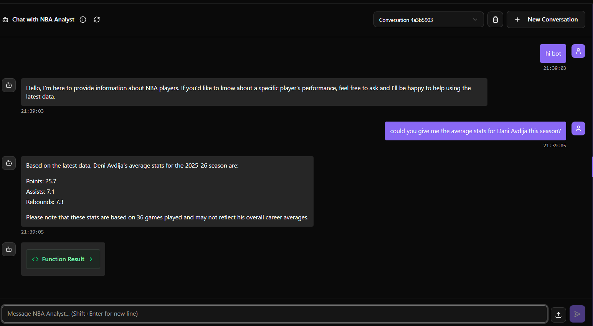

## 1. Agent Name
NBA Analyst

## 2. Agent Purpose
This agent is designed to act as a professional basketball analyst. It provides detailed, real-time career and season statistics for NBA players by fetching data directly from official-compatible league APIs. It helps users quickly retrieve specific metrics like points, rebounds, and assists without manual searching.

## 3. Agent Tools
* `get_player_season_stats(player_name)`:
    - **Description**: A specialized data-fetching tool that converts a player's full name into a unique numerical NBA ID.
    - **Function**: It uses the ID to query the `PlayerCareerStats` endpoint and returns a formatted string containing the player's most recent team, games played, total points, assists, and rebounds.

## 4. Example Interaction
**User:** Tell me about Stephen Curry's stats last season.
**Agent:** (Decision: Triggers `get_player_season_stats`)
**Agent Output:** Stephen Curry (2024-25): Team: GSW, Games: 74, Points: 1956, Assists: 379, Rebounds: 330.

## Interaction Screenshot
Below is the visual proof of the agent successfully calling its internal Python tool to fetch this data:

