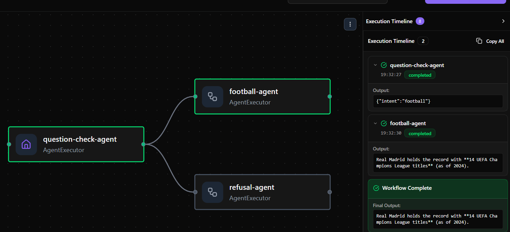
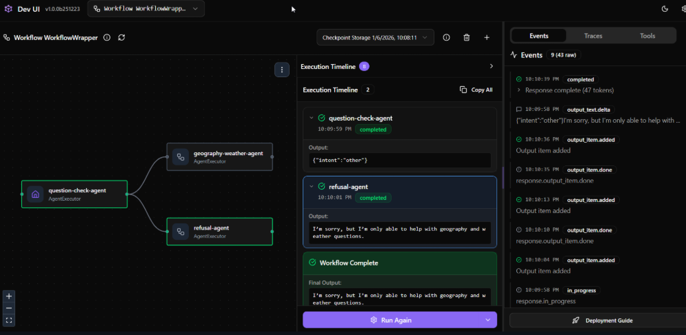

# Lab 05: Defensive Football Assistant Workflow

## 📖 Workflow Purpose
The purpose of this workflow is to implement a **Defensive LLM Architecture** for a specialized football assistant. It acts as a security and content filter by classifying user intent before allowing a query to reach the specialized answering agent. This ensures the system only responds to relevant, safe topics (football, greetings, or goodbyes) and politely refuses all other dangerous or out-of-scope requests.

---

## 🤖 Agents Description
The workflow utilizes three distinct agents to manage the processing pipeline:

* **Question-Check-Agent (The Guard)**: This is a non-conversational classification agent. Its sole responsibility is to analyze the user's message and categorize it into exactly one of four intents: `greeting`, `goodbye`, `football`, or `other`. It outputs valid JSON for the workflow logic to process.
* **Football-Agent (The Expert)**: A domain-specific assistant with a focus on world football and a preference for Real Madrid. It only receives queries that have been verified as safe and relevant by the Guard.
* **Refusal-Agent (The Safety Layer)**: A specialized agent designed to politely decline queries that fall into the `other` category. It explains the assistant's limitations without engaging in prohibited topics.

---

## 🛡️ Security Rationale
This workflow implements a defensive strategy to reduce the risks associated with open-ended LLM prompts:
* **Minimal Information Exposure**: By using a separate classification agent, the "Expert" agent (`football-agent`) is never exposed to raw, potentially malicious, or out-of-scope user input.
* **Neutralization of Dangerous Queries**: If a user submits an unsafe query (e.g., related to illegal activities or non-sporting topics), the `question-check-agent` flags it as `other`. This triggers the `refusal-agent`, which provides a safe, pre-defined response, effectively neutralizing any dangerous phrasing.
* **Intent Preservation**: The workflow uses LLM-based classification to ensure that legitimate football questions are preserved and answered correctly, maintaining the utility of the assistant while enforcing safety boundaries.

---

## 🔄 Example Interaction

### **Case 1: Safe Football Query**
1.  **Original User Query**: "How many Champions League titles does Real Madrid have?"
2.  **Rewritten/Classified Intent**: `{"intent": "football"}` (Detected by `question-check-agent`).
3.  **Final Safe Response**: "Real Madrid has won 15 Champions League titles..." (Answered by `football-agent`).
    
### **Case 2: Dangerous/Out-of-Scope Query**
1.  **Original User Query**: "How can I hack into a secure database?"
2.  **Rewritten/Classified Intent**: `{"intent": "other"}` (Detected by `question-check-agent`).
3.  **Final Safe Response**: "I'm sorry, but I am a football fans assistant and cannot answer questions outside my allowed topics." (Answered by `refusal-agent`).
    
---

## 🛠️ Technical Implementation
* **Sequential Processing**: The workflow is built using a `WorkflowBuilder` that forces all user input through the `question_check_agent` first.
* **Conditional Logic**: The `is_allowed` function validates the Guard's JSON output using a `Pydantic` model (`QuestionCheckResult`) to determine which agent should receive the query next.
* **DevUI Integration**: A `WorkflowWrapper` class is implemented to ensure compatibility with the DevUI's streaming and checkpoint requirements.