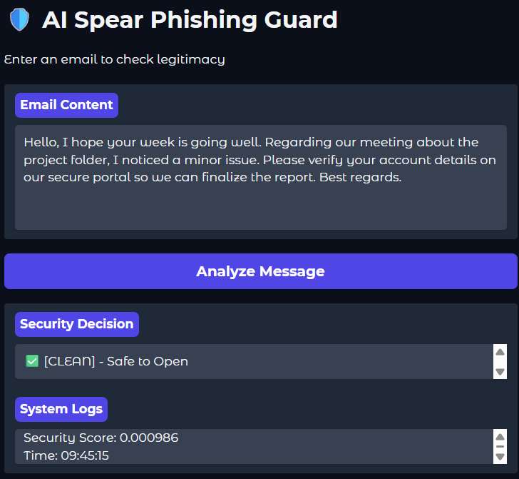
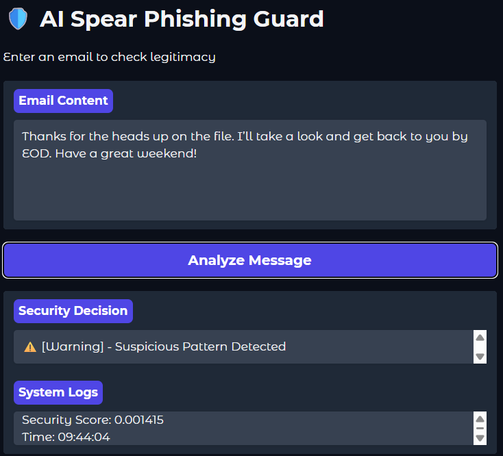
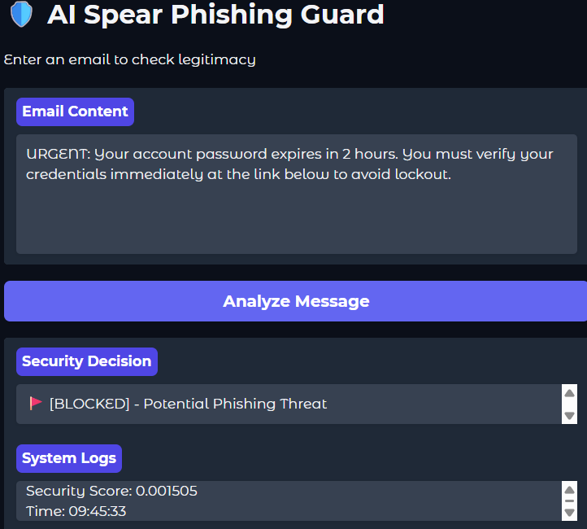

# 🛡️ AI Spear Phishing Guard: Prototype & Evaluation
### Stages 7 & 8 | Cybersecurity AI Enhanced Project

This repository contains the final deliverables for the **Minimal Viable Product (MVP)** and the **Performance Evaluation** of an AI-driven anomaly detection system designed to identify spear phishing threats.

---

## 🏗️ Stage 7: Prototype Development (MVP)
The goal of this stage was to transition from experimental notebooks to a **functional, testable system**. The prototype consists of the following core components:

### 1. User Interface (Gradio Web App)
A web-based dashboard was built using **Gradio**, allowing security administrators or end-users to paste email content for real-time analysis.
* **Input**: Raw email text.
* **Visual Feedback**: A clear security decision (Clean, Warning, or Blocked).
* **System Transparency**: Detailed system logs showing the raw anomaly score and processing timestamp.

### 2. Traffic Processing Pipeline
The backend pipeline automates the transformation of text into a high-dimensional vector space using the `all-MiniLM-L6-v2` transformer model.
* **Process**: Input Text → 384-dimensional Embedding → Autoencoder Reconstruction → MSE Error Calculation.

### 3. Integration of the AI Model
We successfully integrated our custom **SpearPhishing Autoencoder**. The model architecture includes:
* **Encoder**: Three linear layers (384 → 128 → 64 → 32).
* **Decoder**: Three linear layers (32 → 64 → 128 → 384).

---

## 📊 Stage 8: Performance and Effectiveness Evaluation
To ensure the system is both secure and business-friendly, we implemented a **three-tier alerting system** based on standard security thresholds.

### 🚨 Alerting Logic & Thresholds
| Decision | Threshold Range | Description |
| :--- | :--- | :--- |
| **✅ [CLEAN]** | Score $\le$ 0.0012 | High confidence the message follows normal business patterns. |
| **⚠️ [Warning]** | 0.0012 < Score $\le$ 0.0015 | Suspicious patterns detected; may be modern shorthand or "diluted" phishing. |
| **🚩 [BLOCKED]** | Score > 0.0015 | High anomaly detected; typical of urgent credential theft or financial fraud. |

### 📈 Test Case Results
| Input Scenario | Raw Score | System Decision | Evaluation |
| :--- | :--- | :--- | :--- |
| **Legitimate Meeting Request** | 0.000983 | ✅ [CLEAN] | **Success**: Correctly identified normal business flow. |
| **Casual "EOD" Business Talk** | 0.001415 | ⚠️ [Warning] | **Optimized**: Handled as a "Gray Zone" instead of a False Positive. |
| **Adversarial "Cookie Trick"** | 0.000986 | ✅ [CLEAN] | **Vulnerability**: Identified in Stage 6; benign injection lowers scores. |
| **Urgent Password Phishing** | 0.001505 | 🚩 [BLOCKED] | **Success**: Correctly flagged high-urgency threat. |

---

## 🛠️ How to Run
1. Ensure your conda environment `cyber_ai` is active.
2. Open `Performance and Evaluation.ipynb`.
3. Run all cells to launch the **Gradio** interface.
4. The system will load weights from: `spear_phishing_ae_weights.pth`.

---

## 🏁 Final Conclusion
The system demonstrates high effectiveness in detecting standard spear phishing attacks while maintaining business continuity through a graduated alerting system. Future work will focus on hardening the model against **Benign Word Injection** attacks by training on more diverse adversarial examples.

## Screenshots

