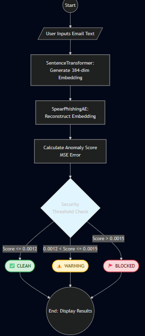

# 🛡️ AI Spear Phishing Guard: Final Project Documentation
### Stage 9: System Architecture, Workflow, and Security Audit

This document provides a comprehensive overview of the AI-powered anomaly detection system designed to identify and mitigate spear phishing threats.

---

## 1. System Architecture
The system utilizes a **Deep Learning Anomaly Detection** architecture to identify emails that deviate from established business communication patterns.

### Technical Stack
* **Vectorization**: `SentenceTransformer` (all-MiniLM-L6-v2) maps text to a 384-dimensional dense vector space.
* **Core Model**: A Custom **Autoencoder (AE)** neural network.
    * **Encoder**: Compresses input (384) → 128 → 64 → 32 (Bottleneck).
    * **Decoder**: Reconstructs compressed data back to 384 dimensions.
* **Frameworks**: PyTorch (Modeling), Gradio (Interface), Scikit-Learn (Metrics).

---

## 2. Workflow Diagram
The following process describes the end-to-end data flow:

1.  **Input Ingestion**: User provides raw email text via the Gradio Web UI.
2.  **Embedding Generation**: The transformer model converts text into a mathematical representation of its meaning.
3.  **Anomaly Scoring**: 
    * The Autoencoder attempts to "reconstruct" the embedding.
    * The **Mean Squared Error (MSE)** is calculated between the original and the reconstruction.
4.  **Decision Logic**:
    * **Low Score (≤ 0.0012)**: System identifies the email as "Clean" (matches training data patterns).
    * **Mid Score (0.0012 - 0.0015)**: System issues a "Warning" (potential anomaly/unfamiliar terminology).
    * **High Score (> 0.0015)**: System "Blocks" the email as a high-risk anomaly.

---

## 3. User Instructions
### Installation
1. Activate the environment: `conda activate cyber_ai`
2. Install dependencies: `pip install torch gradio sentence-transformers`

### Running the Prototype
1. Open the `Performance and Evaluation.ipynb` notebook.
2. Run all cells to initialize the model weights (`spear_phishing_ae_weights.pth`).
3. Use the **Gradio link** generated in the output to open the interface in your browser.
4. Enter text into the box and click **Analyze Message**.

---

## 4. Known Limitations & Vulnerabilities
Through extensive testing and a Stage 6 Security Audit, the following limitations were identified:

* **Adversarial Vulnerability (Benign Word Injection)**: 
    Attackers can bypass detection by appending "safe" corporate keywords (e.g., *meeting, schedule, budget*) to a malicious link. This "dilutes" the anomaly score, potentially moving a "Blocked" status to "Clean."
    
* **Contextual Drift**:
    The model was trained on the Enron dataset (historical business data). Modern business

---

# Video documentation

[*[Youtube video]*](https://youtu.be/nnoqyaXLrgw)